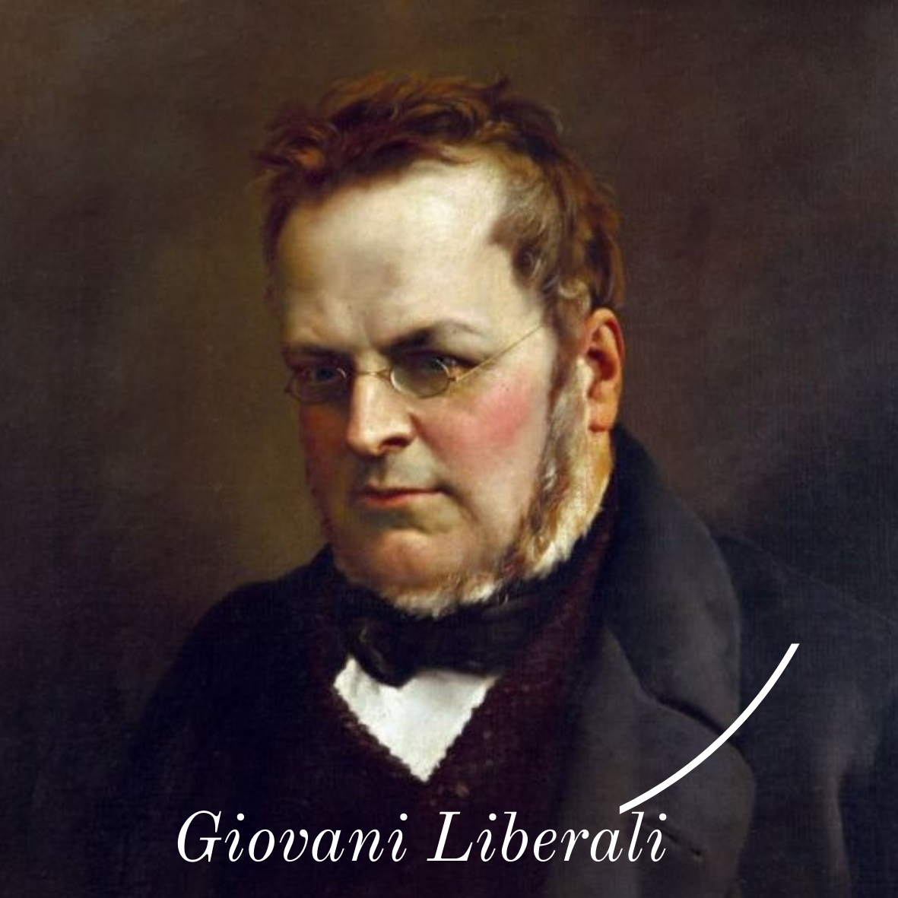

# Giovani Liberali

*Pagina d'entrata*

---

:information_source: [Introduzione](introduzione)    :page_with_curl:[Manifesto](manifesto)    :pen: [Statuto](statuto)
:question:[Domande frequenti](domande_frequenti)     :diamond_shape_with_a_dot_inside: [La direzione](direzione)    :family: [L' assemblea](assemblea)
:globe_with_meridians: [Circoli](circoli)    :credit_card: [Tesseramento](tesseramento)    :email:[Newsletter](newsletter)

---

> "Siamo nati per essere, se vogliamo, creature razionali, ma è solo l'uso e l'esercizio che ci rende tali, e in effetti non siamo così lontani da quanto l'ingegno e l'applicazione ci abbiano portato."
>
> ―    John Locke            [Sulla condotta dell'intelletto](https://it.wikipedia.org/wiki/Sulla_condotta_dell%27intelletto)    

---

:copyright: 2021, Mattia Mascarello

[Perché questo sito è così bello ?](design)

